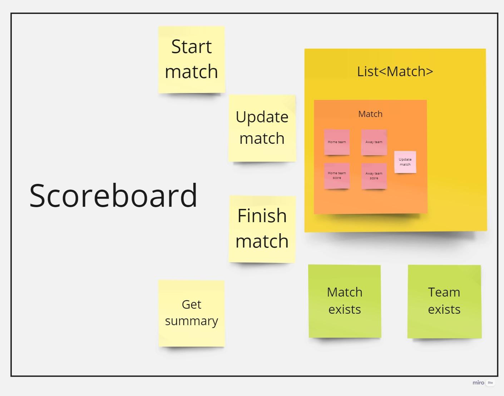

# Live Football Scoreboard

A simple Live Football Scoreboard library written in Python.


## Design



## Assumptions

- One team can play in only one match at a time.
- Score value has to be 0 or greater.
- UpdateScore takes all, even illogical score changes.
- Start match cannot be used if one of the teams is already on the scoreboard.
- Every match starts with the 0 score on both teams

## Documentation
```python
class Match(builtins.object)
 |  Match(homeTeamName, awayTeamName)
 |  
 |  Methods defined here:
 |  
 |  __init__(self, homeTeamName, awayTeamName)
 |      Initialize self.
 |  
 |  getAllGoals(self)
 |      Summarizes the goal score for a single match by adding two single scores
 |      :return: returns the summarized goal value
 |  
 |  updateScore(self, homeTeamScore, awayTeamScore)
 |      Updates the score of a Match object specified as a parameter
 |      :param homeTeamScore: Result of the home team to update with
 |      :param awayTeamScore: Result of the away team to update with
 |      :return:
 |  
```
```python
class Scoreboard(builtins.object)
 |  Methods defined here:
 |  
 |  __init__(self)
 |      Initialize self.
 |  
 |  finishMatch(self, homeTeamName, awayTeamName)
 |      Finishes the match by removing it from the scoreboard
 |      :param homeTeamName: Name of the home team
 |      :param awayTeamName: Name of the away team
 |      :return: returns True if the match was successfully found and removed
 |  
 |  getSummary(self)
 |      A simple method for getting the whole scoreboard summary with the team names and scores, sorted from highest score and starting time.
 |      :return: returns a list with formatted strings for each of the matches currently happening
 |  
 |  startMatch(self, homeTeamName, awayTeamName)
 |      This function starts a new match after checking if any of the teams is not playing already.
 |      :param homeTeamName:  Name of the home team
 |      :param awayTeamName:  Name of the away team
 |  
 |  updateMatch(self, homeTeamName, awayTeamName, homeTeamScore, awayTeamScore)
 |      This function updates an existing match with a result specified in the argument
 |      :param homeTeamName: Name of the home team
 |      :param awayTeamName: Name of the away team
 |      :param homeTeamScore: Score for the home team to be updated with
 |      :param awayTeamScore: Score for the away team to be updated with
 |      :return: returns True if successful
```
## Authors

- [@Andrzej-Bialowas](https://www.github.com/Andrzej-Bialowas)

